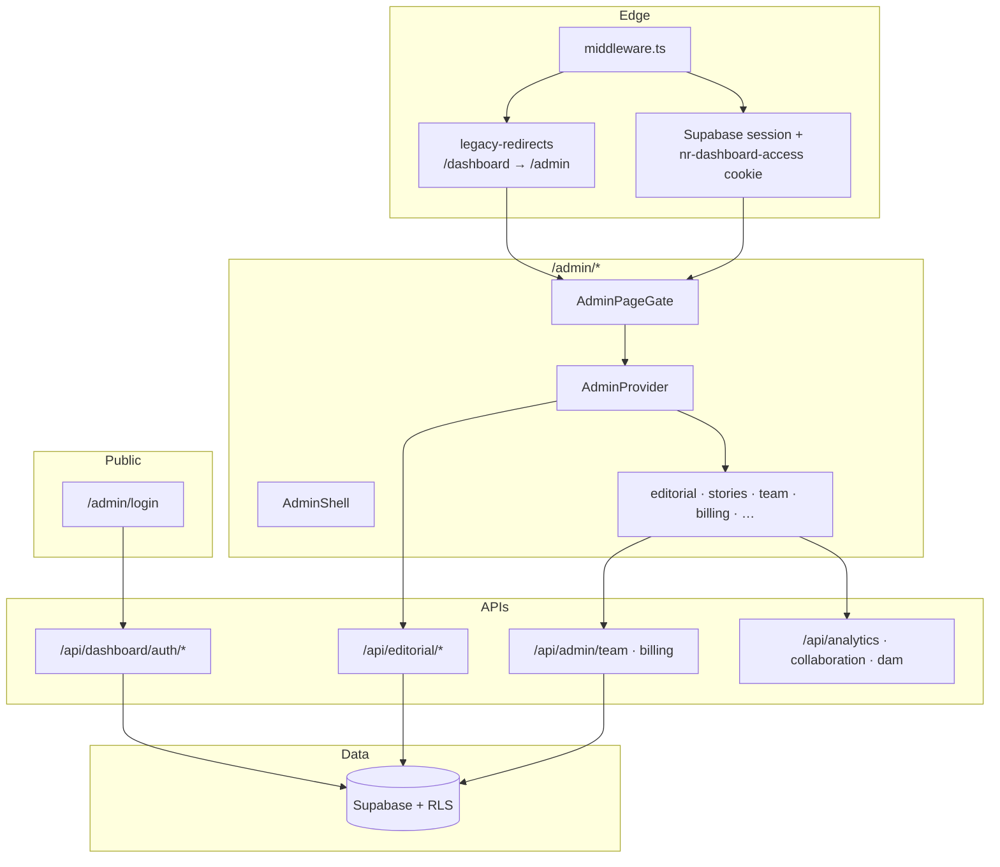

# Admin platform unification

**Status:** Complete (May 2026)  
**Goal:** One production newsroom operating system at `/admin`, with legacy `/dashboard` preserved only as permanent redirects and stable auth API paths.

---

## Migration summary

| Area | Before | After |
|------|--------|--------|
| UI console | `/dashboard` (SaaS client) + `/admin` (Jan Darpan OS) | **`/admin` only** |
| Login | `/dashboard/login` + `/admin/login` | **`/admin/login`** |
| Navigation | `DashboardShell` + `AdminShell` | **`AdminShell`** (single nav) |
| Page guard | `DashboardGate` + `AdminPageGate` | **`AdminPageGate`** |
| RBAC (routes) | `saas-auth` + `newsroom-auth` maps | **`newsroom-auth`** (+ shared `saas-auth` permissions) |
| Team API | `/api/dashboard/team` | **`/api/admin/team`** (dashboard route returns 410) |
| Snapshot / actions | `/api/dashboard/snapshot`, `/actions` | **`/api/editorial/dashboard`**, **`/api/editorial/actions`** (legacy dashboard APIs deprecated, still respond) |
| Auth API | `/api/dashboard/auth/*` | **Unchanged** (cookies + clients; single auth flow via `/admin/login`) |
| Billing | `/dashboard/billing` panel | **`/admin/billing`** + `GET /api/admin/billing` |
| Styles | `saas-dashboard.css` + `admin-newsroom.css` | **`admin-newsroom.css` only** |

Legacy URLs (`/dashboard`, `/dashboard/team`, etc.) return **308 Permanent Redirect** via middleware and `next.config.ts`, with `next` query params rewritten to the matching `/admin/*` path.

---

## Removed legacy modules

### App routes (deleted)

- `src/app/dashboard/**` — all console pages, login, layouts

### Components (deleted)

- `src/components/dashboard/**` — `DashboardShell`, `DashboardProvider`, `DashboardGate`, all `panels/*`

### Providers (deleted)

- `src/providers/EditorialDeskContext.tsx`

### Lib (deleted)

- `src/lib/dashboard/team.ts` — superseded by `lib/newsroom-auth/team-management.ts`

### Styles (deleted)

- `src/styles/saas-dashboard.css` — billing/plan tokens merged into `admin-newsroom.css` (`.anr-plan-card`, `.anr-kpi-*`)

### Retained (shared platform, not UI)

- `src/lib/dashboard/audit.ts`, `actions.ts`, `fetch-snapshot.ts`, `types.ts` — used by editorial APIs and deprecated snapshot route
- `src/lib/saas-auth/**` — session, cookies, base permissions
- `src/lib/newsroom-auth/**` — admin route RBAC, team management
- `src/app/api/dashboard/auth/**` — platform session (login, logout, session)

---

## Unified architecture map

**Auth flow (single):**

1. User opens `/admin/login` (or lands from a legacy `/dashboard/*` redirect).
2. `POST /api/dashboard/auth/login` sets `nr-dashboard-access` / refresh cookies (unchanged for backward compatibility).
3. Middleware allows `/admin/*` when Supabase user or legacy cookie is present.
4. `AdminPageGate` loads membership and enforces `canAccessAdminRoute` + optional permission.

**RBAC layers:**

| Layer | Module | Responsibility |
|-------|--------|----------------|
| Permissions | `lib/saas-auth/rbac.ts` | Role → permission matrix |
| Admin routes | `lib/newsroom-auth/rbac.ts` | Path → permission, super_admin for `/admin/team` |
| Editorial actions | `lib/newsroom-auth/action-permissions.ts` | Mutation-level checks |
| API guards | `lib/saas-auth/guard.ts`, `require-super-admin.ts` | HTTP handlers |

---

## Final admin route structure

| Route | Purpose | RBAC permission |
|-------|---------|-----------------|
| `/admin` | Redirect → `/admin/editorial` | — |
| `/admin/login` | Sign-in | public |
| `/admin/editorial` | Editorial overview | `content:read` |
| `/admin/intelligence` | Intelligence center | `analytics:read` |
| `/admin/editor` | Editor index | `editorial:write` |
| `/admin/editor/[id]` | Article workbench | `editorial:write` |
| `/admin/workflow` | Workflow board | `editorial:write` |
| `/admin/collaboration` | Collaboration hub | `editorial:write` |
| `/admin/stories` | Stories desk | `editorial:write` |
| `/admin/stories/[id]` | Story detail | `editorial:write` |
| `/admin/articles` | Articles | `content:read` |
| `/admin/districts` | Districts | `content:read` |
| `/admin/topics` | Topics | `content:read` |
| `/admin/sources` | Sources / providers | `providers:read` |
| `/admin/live-wire` | Live wire | `content:read` |
| `/admin/ingestion` | Ingestion monitor | `monitoring:read` |
| `/admin/images` | Images | `editorial:write` |
| `/admin/media` | Media DAM | `editorial:write` |
| `/admin/analytics` | Analytics | `analytics:read` |
| `/admin/billing` | Billing & usage | `billing:read` |
| `/admin/team` | Team management | `super_admin` only |

### Legacy redirect map (`/dashboard` → `/admin`)

| Legacy | Unified |
|--------|---------|
| `/dashboard` | `/admin/editorial` |
| `/dashboard/login` | `/admin/login` |
| `/dashboard/content` | `/admin/stories` |
| `/dashboard/publish` | `/admin/stories` |
| `/dashboard/editorial` | `/admin/editorial` |
| `/dashboard/providers` | `/admin/sources` |
| `/dashboard/analytics` | `/admin/analytics` |
| `/dashboard/monitoring` | `/admin/ingestion` |
| `/dashboard/team` | `/admin/team` |
| `/dashboard/billing` | `/admin/billing` |
| `/dashboard/*` (other) | `/admin/editorial` |

Implementation: `src/lib/admin-platform/legacy-redirects.ts`, `src/middleware.ts`, `next.config.ts` `redirects()`.

---

## API compatibility

| Endpoint | Status |
|----------|--------|
| `POST /api/dashboard/auth/login` | **Stable** — use from `/admin/login` |
| `POST /api/dashboard/auth/logout` | **Stable** |
| `GET /api/dashboard/auth/session` | **Removed from client flows** — server layout and middleware resolve auth |
| `GET /api/dashboard/snapshot` | **Deprecated** — `Deprecation` header; use `/api/editorial/dashboard` |
| `POST /api/dashboard/actions` | **Deprecated** — use `/api/editorial/actions` |
| `GET/POST/PATCH /api/dashboard/team` | **Removed** — 410 + `successor: /api/admin/team` |
| `GET /api/admin/billing` | **New** |
| `GET/POST/PATCH/DELETE /api/admin/team` | **Canonical** team management |

Sessions and cookies are unchanged; bookmarks to `/dashboard/...` continue to work via redirect.

---

## Production simplification report

### Duplication removed

- **2 shells** → 1 (`AdminShell`)
- **2 login pages** → 1 (`/admin/login`)
- **2 client data providers** → 1 (`AdminProvider` → editorial APIs)
- **2 team UIs** → 1 (`TeamManagementPanel` + `/api/admin/team`)
- **2 CSS entrypoints** for console → 1 (`admin-newsroom.css`)

### Lines of code / surface area

- Removed ~15 dashboard page files and ~10 panel components.
- Middleware no longer maintains separate `/dashboard` auth branch (redirect runs first).
- `useStoriesDesk` simplified to admin-only context.

### Operational notes

1. Update external docs/bookmarks from `/dashboard` to `/admin` when convenient; redirects are permanent.
2. Integrations calling `/api/dashboard/team` must switch to `/api/admin/team`.
3. Auth cookie names remain `nr-dashboard-access` / `nr-dashboard-refresh` — no forced re-login.
4. Optional cleanup later: rename `/api/dashboard/auth` → `/api/platform/auth` (not required for unification).

### Orphan asset

- `src/styles/editorial-dashboard.css` — not imported; safe to delete in a follow-up.

---

## Key files (post-unification)

| File | Role |
|------|------|
| `src/lib/admin-platform/legacy-redirects.ts` | Path mapping |
| `src/lib/admin-platform/api-deprecation.ts` | Deprecation headers |
| `src/middleware.ts` | Tenant + auth + legacy redirect |
| `src/components/admin-newsroom/AdminPageGate.tsx` | Server auth gate |
| `src/components/admin-newsroom/AdminShell.tsx` | Navigation |
| `src/lib/newsroom-auth/rbac.ts` | Admin route permissions |
| `docs/ADMIN_PLATFORM_UNIFICATION.md` | This document |
