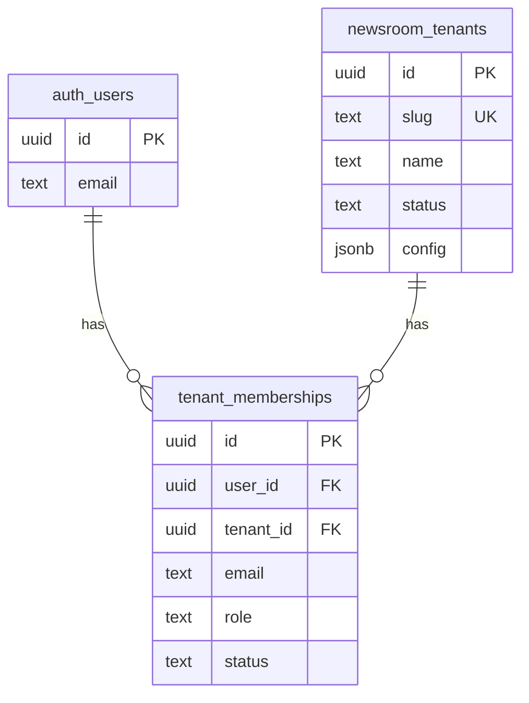
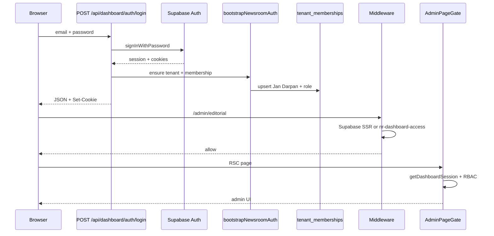

# Newsroom Auth Normalization — Complete

Production-ready RBAC for Jan Darpan newsroom admin. Apply migration **024** on Supabase, then deploy the app.

## Pre-migration analysis

See [AUTH_SCHEMA_COMPATIBILITY_REPORT.md](./AUTH_SCHEMA_COMPATIBILITY_REPORT.md) for drift detected before changes (dual roles, missing `name`, RLS gaps, legacy `owner`/`publisher`).

## Canonical schema

### `newsroom_tenants`

| Column | Type | Notes |
|--------|------|--------|
| `id` | uuid PK | Preserved from whitelabel preset |
| `slug` | text unique | e.g. `jan-darpan-chhattisgarh` |
| `name` | text | Display name (added in 024) |
| `status`, `domains`, `config` | — | Unchanged — production config kept |
| `created_at`, `updated_at` | timestamptz | Unchanged |

### `tenant_memberships`

| Column | Type | Notes |
|--------|------|--------|
| `id` | uuid PK | |
| `user_id` | uuid → `auth.users` | FK with NOT VALID → validate when no orphans |
| `tenant_id` | uuid → `newsroom_tenants` | |
| `email` | text | Lowercased in app |
| `role` | text | `super_admin` \| `editor` \| `moderator` \| `journalist` |
| `status` | text | default `active` |
| `created_at` | timestamptz | |

### Role mapping (legacy → canonical)

| Legacy | Canonical |
|--------|-----------|
| owner, admin | super_admin |
| publisher | moderator |
| editor | editor |
| viewer, billing | journalist |

## Schema diagram



## Auth flow



1. **Login** — Sets Supabase SSR cookies and `nr-dashboard-access` / refresh on the JSON response (fixes redirect loop).
2. **Bootstrap** — On login and on first session load without membership: creates/updates Jan Darpan tenant and membership; `shriyanshchandrakar@gmail.com` → `super_admin`.
3. **Middleware** — Protects `/admin/*`; authenticated users skip `/admin/login`.
4. **AdminPageGate** — `getDashboardSession()` + `canAccessAdminRoute()`; redirects to login with `?next=` if unauthenticated.

## SQL executed (migration 024)

File: `supabase/migrations/024_newsroom_auth_normalize.sql`

- Add `newsroom_tenants.name`, backfill from config/slug
- Seed/update Jan Darpan tenant (`jan-darpan-chhattisgarh`)
- Migrate all membership roles to canonical set
- Replace `tenant_memberships_role_check` constraint
- Add FK `user_id` → `auth.users` (NOT VALID, validate if no orphans)
- Indexes on `(user_id, status)` and `lower(email)`
- RLS: users read own row; super_admin read tenant rows; service_role full access
- SQL bootstrap: `shriyanshchandrakar@gmail.com` → `super_admin` when auth user exists

**Apply on Supabase:**

```bash
supabase db push
```

Or paste `024_newsroom_auth_normalize.sql` into the SQL editor (runs after 017–023).

**Repair API (optional):**

```bash
curl -X POST https://YOUR_DOMAIN/api/admin/auth/bootstrap \
  -H "Authorization: Bearer $CRON_SECRET" \
  -H "Content-Type: application/json" \
  -d '{"email":"shriyanshchandrakar@gmail.com"}'
```

## Files changed

| Area | Files |
|------|--------|
| Migration | `supabase/migrations/024_newsroom_auth_normalize.sql` |
| Roles / RBAC | `src/lib/saas-auth/roles.ts`, `types.ts`, `rbac.ts`, `session.ts` |
| Newsroom RBAC | `src/lib/newsroom-auth/rbac.ts`, `bootstrap.ts` |
| Login | `src/app/api/dashboard/auth/login/route.ts` |
| Bootstrap API | `src/app/api/admin/auth/bootstrap/route.ts` |
| Team UI | `src/components/dashboard/panels/TeamPanel.tsx`, `src/lib/dashboard/team.ts` |
| Types | `src/lib/supabase/types.ts` |
| Docs | `docs/AUTH_SCHEMA_COMPATIBILITY_REPORT.md`, this file |

## Super admin

- Email: **shriyanshchandrakar@gmail.com**
- Role: **super_admin**
- Tenant: **Jan Darpan Chhattisgarh** (`jan-darpan-chhattisgarh`)
- Ensured by: migration 024 SQL, login bootstrap, session auto-repair, `NEWSROOM_SUPER_ADMIN_EMAILS` env (optional comma list)

## Verification checklist

- [ ] Run migration 024 on production Supabase
- [ ] Sign in at `/admin/login` → lands on `/admin/editorial` (no loop)
- [ ] Hard refresh stays logged in
- [ ] Logout clears cookies
- [ ] Non–super_admin roles blocked from publish routes per RBAC
- [ ] Articles/stories/admin pages still load (no content tables touched)

## What was not changed

- Article/story/editorial tables and content
- `newsroom_tenants.config` / domains / billing tables
- Public site auth (only dashboard/admin newsroom auth)

Build verified: `npm run build` passes.
