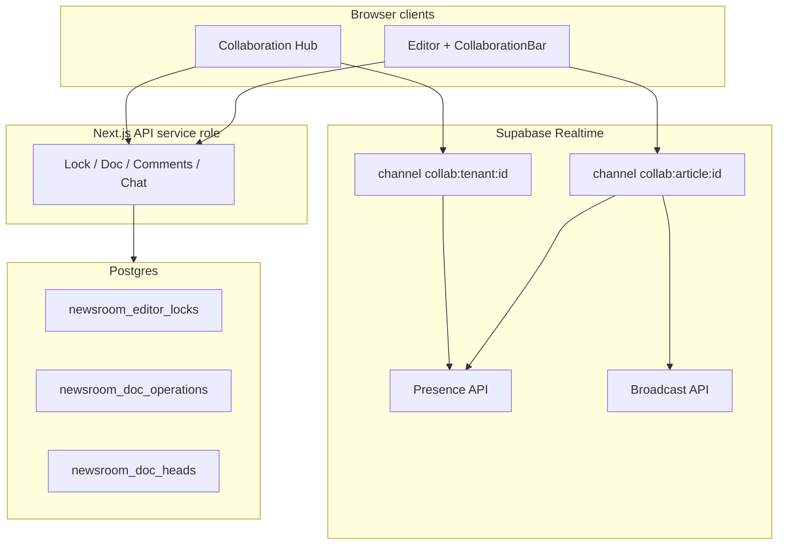

# Realtime Newsroom Collaboration

## Routes

| Route | Purpose |
|-------|---------|
| `/admin/collaboration` | Team hub — activity, chat, notifications, approvals |
| `/admin/editor/[id]` | Article editor with `CollaborationBar` (presence, lock, live sync) |

## Features map

| Feature | Implementation |
|---------|----------------|
| Live multi-user editing | Supabase Broadcast `doc` events + debounced HTML sync |
| Presence indicators | Supabase Presence on `collab:article:*` / `collab:tenant:*` |
| Inline comments | `newsroom_inline_comments` + editor drawer |
| Mentions | `mentions uuid[]` on comments/chat → `newsroom_notifications` |
| Newsroom chat | `newsroom_chat_messages` + tenant broadcast room |
| Assignment notifications | `notifyAssignment` on workflow assign API |
| Collaborative review | Approval requests + workflow comments (existing) |
| Live typing indicators | Broadcast `typing` + presence `typing` flag |
| Editor locks | `newsroom_editor_locks` pessimistic lock (5 min TTL) |
| Approval requests | `newsroom_approval_requests` |
| Activity feed | `newsroom_activity_events` |
| Live publishing alerts | `logPublishingAlert` / activity `published` events |

## Realtime architecture

### Transport layers

1. **WebSocket (Supabase Realtime)** — ephemeral: presence, typing, live HTML broadcast (not durable).
2. **HTTP API** — durable: locks, comments, chat history, notifications, OT log append.
3. **Postgres changes** — optional future: `postgres_changes` on comments for instant thread refresh.

### Channels

- `collab:article:{articleId}` — editors on one story
- `collab:tenant:{tenantId}` — desk-wide chat and presence

## Conflict resolution strategy

We use a **hybrid** model (not full CRDT/Yjs in v1):

### 1. Pessimistic editor lock (primary)

- One **lock holder** per article (`newsroom_editor_locks`).
- Others see **read-only** banner; can comment but should not save over lock owner.
- Lock **heartbeats** every 60s; expires after 5 minutes if tab closed.

### 2. OT-lite version log (durable)

- `newsroom_doc_heads.version` monotonic per article.
- Each save/broadcast persists `newsroom_doc_operations` with `content_hash`.
- Server rejects ops with `version <= head` (`409 stale_version`).

### 3. Ephemeral merge (live typing)

- `mergeBroadcastHtml()` applies **last-writer-wins** by version number.
- If versions equal, prefers **longer HTML** from remote peer (typing convergence).
- `hashContent()` detects divergent bases for future three-way merge UI.

### 4. Authoritative save

- TipTap **autosave to API** remains source of truth for published content.
- Broadcast is for **live preview** among editors; final merge on save uses article PATCH.

### When conflicts occur

| Scenario | Resolution |
|----------|------------|
| Two editors without lock race | Lock API blocks second acquirer |
| Stale broadcast version | Ignored (`incomingVersion <= local`) |
| Save during remote edit | Lock owner wins; others refresh on load |
| Hash mismatch at append | `409` — client should refetch article |

### Future upgrades

- Yjs/CRDT binding for TipTap
- `postgres_changes` subscription on `newsroom_inline_comments`
- Push notifications (web push) for mentions

## Setup

1. Run migration **`031_newsroom_collaboration.sql`**
2. Enable **Realtime** for project in Supabase Dashboard
3. Ensure authenticated users can connect (anon key + session); broadcast works without table RLS for clients

## APIs

- `GET /api/collaboration/hub`
- `POST /api/collaboration/lock`
- `GET/POST /api/collaboration/comments`
- `POST /api/collaboration/chat`
- `POST /api/collaboration/approvals`
- `POST /api/collaboration/doc`
- `PATCH /api/collaboration/notifications`
