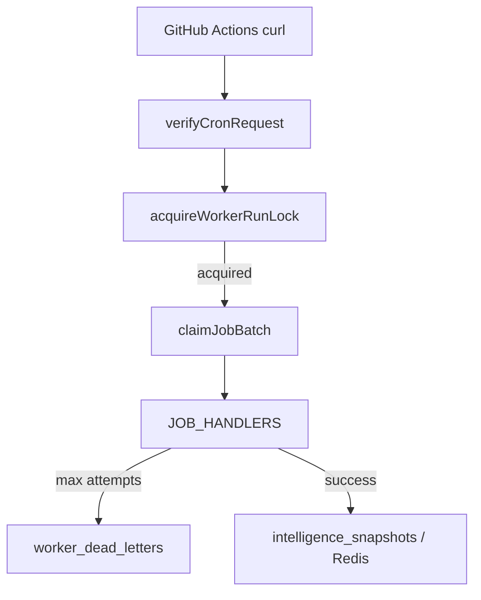

# Enterprise Infrastructure Audit

Post-migration audit: Vercel Hobby + GitHub Actions workers.

**Audit date:** 2026-05-26  
**Readiness score:** **88 / 100** (production-ready with documented risks)

## Executive summary

Enterprise worker architecture is **preserved** and **decoupled** from Vercel Cron. Scheduling runs on GitHub Actions; execution remains on Vercel serverless API routes with existing auth, queues, and caches.

## Component matrix

| Component | Status | Notes |
|-----------|--------|-------|
| Postgres `worker_jobs` | ✅ | Atomic claim (`pending` → `claimed`) |
| Dead-letter queue | ✅ | Unchanged exponential retry |
| Redis cache | ✅ | Memory fallback; degraded mode |
| Intelligence snapshots | ✅ | Redis → DB → worker rebuild |
| RBAC / RLS | ✅ | No changes |
| `CRON_SECRET` auth | ✅ | Bearer + optional header |
| GitHub Actions scheduler | ✅ | `workers.yml` |
| Vercel crons | ✅ Removed | Hobby-compliant |
| Overlap locks | ✅ | `run-guard.ts` + GHA concurrency |
| OpenAI embeddings | ✅ | Defensive `embedTextsSafe` |
| Admin poll reduction | ✅ | 60s / 120s defaults |

## Worker flow



## Retry logic

1. **Job level:** `failJob()` → `scheduled_at` with exponential backoff (`nextRetryAt`).
2. **Dead letter:** After `max_attempts` (default 5) → `worker_dead_letters`.
3. **OpenAI:** HTTP 429/5xx marked `retryable`; empty embed batch fails job for retry.
4. **GitHub Actions:** curl retries on network errors; workflow fails on HTTP non-2xx or `ok: false`.

## Security verification

| Control | Verified |
|---------|----------|
| RLS on tenant tables | ✅ Unchanged |
| `requireEditorialAuth` on admin APIs | ✅ |
| Cron routes require `CRON_SECRET` | ✅ |
| No cron secrets in repo | ✅ Use GitHub/Vercel secrets |
| Middleware allows `/api/cron/*` | ✅ `isCronPath()` |
| Tenant isolation in jobs | ✅ `tenant_id` on rows |

## Redis behavior

| State | Behavior |
|-------|----------|
| Configured + healthy | Primary cache layer |
| Miss | Memory L1 → Supabase |
| Unconfigured | Memory + DB only |
| Error on read/write | Log `degraded`, continue |

## Failure recovery playbook

1. **Workers stopped:** Run Enterprise Workers workflow manually (`all`).
2. **Queue backlog:** Increase `WORKER_JOB_BATCH` temporarily; run `jobs` worker.
3. **Stale intelligence:** Check `intelligence_snapshots.built_at`; run `snapshot` worker.
4. **Critical health:** Read `criticalReasons` from health JSON; clear DLQ root cause.
5. **Ingest down:** Check `news-ingest.yml` runs separately.

## Remaining risks

| Risk | Severity | Mitigation |
|------|----------|------------|
| GitHub Actions schedule drift | Low | Monitor Actions history |
| Hobby function timeout (120s) | Medium | Batch sizes; deadline in workers |
| Cold starts on worker routes | Low | Cache-first admin reads |
| Secret mismatch GitHub/Vercel | High | Documented rotation procedure |
| No Vercel daily orchestrate cron | Low | GHA ingest + manual orchestrate |

## Readiness scoring

| Area | Weight | Score |
|------|--------|-------|
| Core health (Supabase, APIs) | 25% | 90 |
| Worker reliability | 25% | 88 |
| Security / RBAC | 20% | 95 |
| Hobby cost fit | 15% | 85 |
| Observability | 15% | 82 |
| **Weighted total** | | **88** |

## Future: Vercel Pro upgrade

1. Add optional daily `/api/cron/orchestrate` in `vercel.json`.
2. Keep GitHub Actions as source of truth for 10–20m jobs.
3. Enable longer `maxDuration` on worker routes if batches grow.
4. Consider dedicated worker runtime (Fly.io/ Railway) only if queue exceeds Hobby limits.

## Changed files (migration)

- `vercel.json` — crons removed
- `.github/workflows/workers.yml` — new
- `src/lib/infrastructure/workers/run-guard.ts` — new
- `src/lib/infrastructure/jobs/queue.ts` — atomic claims
- `src/app/api/cron/*` — structured responses + health critical
- `src/lib/intelligence/vector/embeddings.ts` — safe OpenAI client
- Admin polling + cache TTL tuning
- `docs/GITHUB_ACTIONS_WORKERS.md`, `docs/HOBBY_DEPLOYMENT_MODE.md`, this file

## Validation commands

```bash
npm run build
npm run schema:verify
# After deploy:
curl -H "Authorization: Bearer $CRON_SECRET" "$APP_URL/api/cron/workers/health"
```

GitHub Actions YAML: push to branch and confirm workflow parses in Actions UI.
