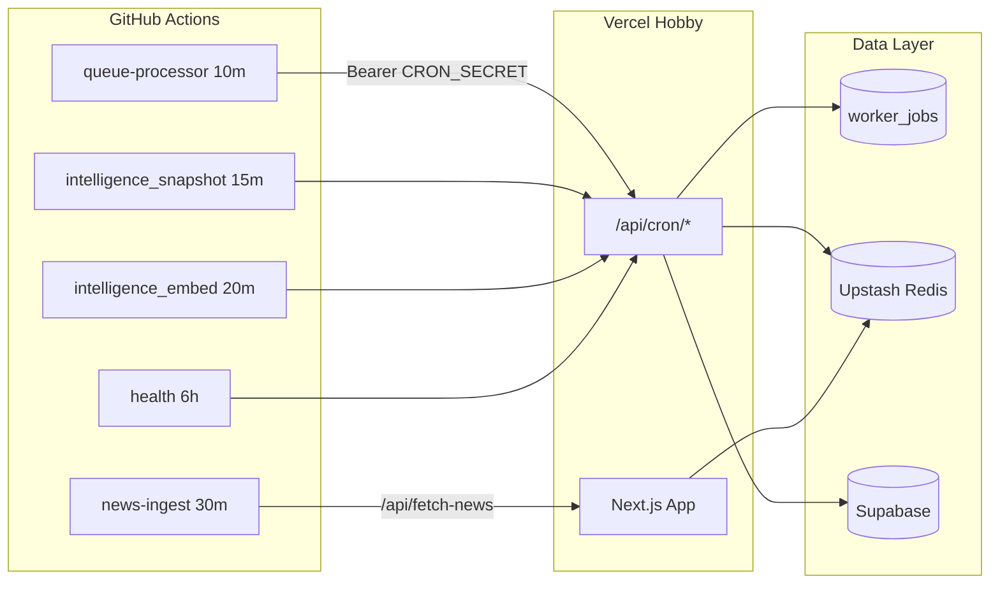

# GitHub Actions Worker Scheduler

> **Primary scheduler:** [Upstash QStash](./QSTASH_SCHEDULER_SETUP.md) — every 30 minutes.  
> **This workflow:** manual-only (`workflow_dispatch`) for emergency runs and soak tests.

Jan Darpan OS uses **Upstash QStash** for production scheduling so the app stays on **Vercel Hobby** while preserving Postgres job queues, Redis caching, Supabase pipelines, RBAC, and intelligence workers.

## Architecture



## Workflow file

`.github/workflows/workers.yml`

| Job | Schedule | Endpoint | Lock window |
|-----|----------|----------|-------------|
| `queue-processor` | `*/10 * * * *` | `POST /api/cron/jobs` | 9 min |
| `intelligence-snapshot` | `*/15 * * * *` | `POST /api/cron/worker/intelligence_snapshot` | 14 min |
| `intelligence-embed` | `*/20 * * * *` | `POST /api/cron/worker/intelligence_embed` | 19 min |
| `workers-health` | `0 */6 * * *` | `GET /api/cron/workers/health` | — |

News ingestion remains in `.github/workflows/news-ingest.yml` (30 minutes).

## Security

- **Authentication:** `Authorization: Bearer ${{ secrets.CRON_SECRET }}` — same validation as `verifyCronRequest()` in the app.
- **Secrets:** Store `CRON_SECRET` and `APP_URL` in GitHub repository secrets only (never in workflow YAML).
- **No weakening:** RLS, RBAC, middleware auth, tenant isolation, and audit logging are unchanged.
- **Overlap protection:** Each worker endpoint uses `acquireWorkerRunLock()` plus job-level GitHub `concurrency` groups.

## Retry-safe execution

- `curl --retry 2 --retry-delay 5 --retry-all-errors` on transient network failures.
- Queue processor retries up to 3 attempts with 8s backoff.
- Worker jobs use Postgres exponential backoff (`nextRetryAt`) and dead-letter routing after `max_attempts`.

## Structured responses

Worker POST endpoints return:

```json
{
  "ok": true,
  "processed": 4,
  "failed": 0,
  "duration_ms": 18234,
  "skipped": false,
  "details": {}
}
```

`skipped: true` with `reason: "overlap_lock"` means a concurrent run was already in progress (safe no-op).

## Health failures

`GET /api/cron/workers/health` returns HTTP **503** when `critical: true`:

- Dead letters ≥ `WORKER_CRITICAL_DLQ` (default 50)
- Stuck claimed jobs ≥ `WORKER_CRITICAL_CLAIMED` (default 15)
- Core worker success rate below `WORKER_CRITICAL_SUCCESS_RATE` (default 0.35)

The GitHub health job fails the workflow on `critical: true`.

## Manual run

Actions → **Enterprise Workers** → **Run workflow**.

Scheduled runs were removed in favor of QStash. See [QSTASH_SCHEDULER_SETUP.md](./QSTASH_SCHEDULER_SETUP.md).

## Required GitHub secrets

| Secret | Example |
|--------|---------|
| `APP_URL` | `https://your-app.vercel.app` |
| `CRON_SECRET` | Same value as Vercel `CRON_SECRET` |

## Deployment flow

1. Deploy app to Vercel (no `crons` in `vercel.json`).
2. Set `CRON_SECRET`, Supabase, Redis, OpenAI on Vercel.
3. Add matching GitHub secrets.
4. Push `.github/workflows/workers.yml` to default branch.
5. Verify first scheduled runs in Actions tab.

## Failure recovery

| Symptom | Action |
|---------|--------|
| 401 from worker curl | Rotate/sync `CRON_SECRET` between GitHub and Vercel |
| `overlap_lock` in logs | Normal — skip or widen schedule |
| Growing `worker_dead_letters` | Inspect `last_error`, fix handler, re-enqueue |
| Redis degraded | App uses memory + DB snapshots; restore Upstash |
| OpenAI 429 | Embeddings retry via job queue; check rate limits |

## Related docs

- [HOBBY_DEPLOYMENT_MODE.md](./HOBBY_DEPLOYMENT_MODE.md)
- [ENTERPRISE_INFRA_AUDIT.md](./ENTERPRISE_INFRA_AUDIT.md)
- [WORKER_ARCHITECTURE.md](./WORKER_ARCHITECTURE.md)
