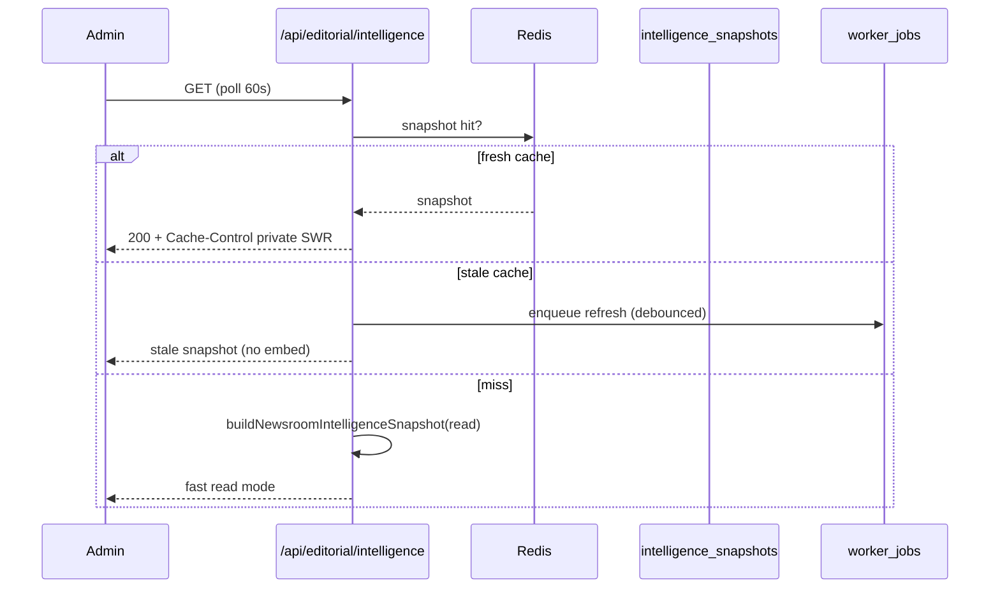

# Vercel Hobby Deployment Mode

Jan Darpan OS is optimized for **Vercel Hobby** while retaining enterprise worker architecture off-platform.

## What moved off Vercel

| Capability | Hobby approach |
|------------|----------------|
| Sub-daily cron | GitHub Actions (`workers.yml`, `news-ingest.yml`) |
| Heavy queue drain | `POST /api/cron/jobs` via Actions |
| Intelligence precompute | Scheduled worker HTTP calls |
| Daily orchestrate backup | Manual `workflow_dispatch` or optional Pro cron later |

## What stays on Vercel

- Next.js app, API routes, middleware auth
- Redis (Upstash REST) with memory fallback
- Supabase RLS + service-role workers
- Admin UI, intelligence read APIs, analytics

## Serverless load reductions

| Area | Default | Env override |
|------|---------|--------------|
| Admin dashboard poll | 60s | `NEXT_PUBLIC_ADMIN_POLL_MS` |
| Analytics panel poll | 120s | `NEXT_PUBLIC_ADMIN_ANALYTICS_POLL_MS` |
| Intelligence center poll | 60s | (client interval) |
| Dashboard API cache TTL | 60s | `DASHBOARD_CACHE_TTL_SEC` |
| Intelligence cache TTL | 90s | `INTELLIGENCE_CACHE_TTL_SEC` |
| Analytics cache TTL | 120s | `ANALYTICS_CACHE_TTL_SEC` |

## Read path (no embedding on refresh)



Dashboard refreshes **do not** trigger embedding jobs. Embeddings run only via `intelligence_embed` worker schedule and explicit admin actions.

## Redis degraded mode

If Upstash is down or misconfigured:

- `cacheGet` / `cacheSet` fall back to in-process memory cache
- Intelligence reads use `intelligence_snapshots` in Postgres
- APIs return `X-Cache-Degraded: 1` on intelligence routes when Redis is absent
- **Workers and APIs do not crash** on Redis errors

## vercel.json

Hobby deployment uses an empty cron list:

```json
{
  "$schema": "https://openapi.vercel.sh/vercel.json"
}
```

All preserved endpoints remain deployed as API routes.

## Environment checklist (Vercel)

```
CRON_SECRET=
NEXT_PUBLIC_SUPABASE_URL=
SUPABASE_SERVICE_ROLE_KEY=
UPSTASH_REDIS_REST_URL=
UPSTASH_REDIS_REST_TOKEN=
OPENAI_API_KEY=
```

## Upgrade path to Vercel Pro

When moving to Pro, you may **optionally** re-add `crons` in `vercel.json` as a secondary trigger. Keep GitHub Actions as primary for overlap locks and observability in Actions logs.

Recommended Pro addition (backup only):

```json
{
  "crons": [
    { "path": "/api/cron/orchestrate", "schedule": "0 8 * * *" }
  ]
}
```

Do not duplicate high-frequency jobs unless Actions reliability is proven insufficient.

## Deploy commands

```bash
cd newspaper-motion
npm run build
npx vercel --prod
```

Ensure GitHub secrets are set before relying on workers.
