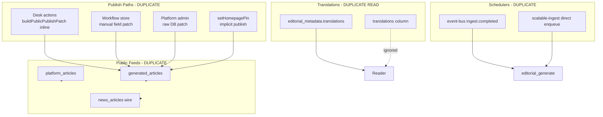
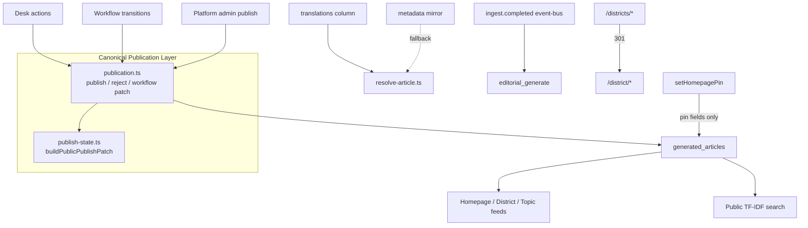

# Phase 2 — Architecture & Data Integrity Report

**Project:** Jandarpan.news  
**Date:** 2026-07-04  
**Status:** PASS  
**Scope:** Canonical architecture unification (no Phase 3, no UI redesign, no new reader features)

---

## 1. Executive Summary

Phase 2 established a single canonical architecture for the platform’s core business processes. Before this phase, publish/reject logic was duplicated across the editorial desk, workflow engine, and platform admin; public feeds merged three article sources; translations were dual-written but read from the wrong store; district pages existed on two URL schemes; and ingestion could enqueue `editorial_generate` twice.

This phase introduces **`src/lib/editorial/publication.ts`** as the single publication layer, routes all desk and admin publish/reject mutations through it, unifies workflow transitions via `buildWorkflowTransitionPatch`, consolidates public feeds to **`generated_articles` only**, makes the **`translations` column** the canonical read path, redirects **`/districts/*` → `/district/*`**, and removes the duplicate post-ingest job enqueue.

**Build:** `npm run typecheck` PASS | `npm run build` PASS

---

## 2. Architecture Dependency Map

### Editorial & Publishing

```
Reader / Homepage / Search / District pages
    └── generated_articles (canonical public store)
            └── isPublicGeneratedArticle()  ← publish-state.ts

Desk actions (/api/editorial/actions)
    └── editorial-dashboard/actions.ts
            └── publication.ts (publish / reject)
                    └── buildPublicPublishPatch() / buildRejectPatch()

Workflow board (/api/editorial/workflow/*)
    └── editorial-workflow/store.ts
            └── transitionWorkflow()
                    └── publication.ts buildWorkflowTransitionPatch()
                    └── editorial_workflow_events (audit)

Platform admin patch
    └── platform-admin/articles.ts
            └── buildPublicPublishPatch / buildRejectPatch (generated source)

Publish visibility gate (single rule)
    └── newsroom/publish-state.ts
```

### AI Pipeline

```
RSS / Wire Ingest
    └── scalable-ingest.ts
            ├── news_signals → news_events (clustering)
            ├── news_articles (legacy staging, optional bridge)
            └── event-bus publishIngestCompleted
                    └── worker_jobs: editorial_generate, event_cluster, …

Article Generation
    └── editorial_generate worker → generated_articles (draft)

Image Generation
    └── editorial_image_queue → hero_image_url

Translation
    └── translation workers → persistArticleTranslations()
            ├── generated_articles.translations (canonical write + read)
            └── editorial_metadata.translations (compatibility mirror)

Embeddings / Intelligence
    └── intelligence workers (separate from public TF-IDF search)
```

### Queues & Schedulers

| Queue / Scheduler | Owner | Canonical? |
|---|---|---|
| `worker_jobs` + event-bus | infrastructure/jobs | **Yes** — primary orchestration |
| QStash decomposed workers | infrastructure/workers | **Yes** — scheduled ingest/generate |
| `/api/cron/orchestrate` | manual/on-demand only | **Compatibility** — not for vercel.json crons |
| Direct post-ingest enqueue | scalable-ingest | **Removed** — was duplicate |
| `news_ai_queue` + `/api/process-ai` | legacy | **Staging only** — deprecate when bridge off |
| `editorial_image_queue` | editorial images | **Yes** |

### Search

| System | Scope | Canonical for readers? |
|---|---|---|
| `src/lib/search/` TF-IDF | Public search page | **Yes** |
| Admin ilike queries | Platform admin | Admin-only |
| Intelligence vectors | Recommendations/embeddings | Internal |

### District Routing

| Route | Data source | Status |
|---|---|---|
| `/district/[slug]` | `generated_articles` + CG_DISTRICTS | **Canonical** |
| `/districts/[district]` | Was merged platform feed | **301 → /district/[slug]** |

---

## 3. Current State Diagram (Before Phase 2)



---

## 4. Target State Diagram (After Phase 2)



---

## 5. Migration Strategy

| Step | Action | Risk | Rollback |
|---|---|---|---|
| 1 | Introduce `publication.ts` | Low | Revert file; callers unchanged |
| 2 | Route desk + workflow + admin through it | Medium | Revert action/store/admin files |
| 3 | Fix `setHomepagePin` side effects | Low | Restore old pin patch if needed |
| 4 | Feeds → generated only | Medium | Re-enable platform/wire merge in feed files |
| 5 | Translation read → column first | Low | Revert resolve-article.ts |
| 6 | District redirect | Low | Remove next.config redirect |
| 7 | Remove duplicate ingest enqueue | Low | Re-add enqueue block in scalable-ingest |

No database migrations required for Phase 2 code changes. Existing rows with metadata-only translations remain readable via fallback.

---

## 6. Risk Assessment

| Risk | Severity | Mitigation |
|---|---|---|
| Feed content reduction (no platform_articles/wire on topic/district feeds) | Medium | `platform_articles` had no insert path; wire content flows through generation pipeline |
| Desk approve bypasses Kanban states | Low (pre-existing) | Documented; workflow board remains canonical for multi-step review |
| Legacy `/api/dashboard/actions` still exists | Low | Deprecated wrapper; routes to same publication layer |
| `news_articles` legacy pipeline still active | Medium | Controlled by `NEWSROOM_LEGACY_BRIDGE`; remove in future phase |
| Triple scheduler (QStash + vercel crons + GH Actions) | Medium | Documented; orchestrate marked on-demand only |

---

## 7. Dependency Order (Implementation)

1. `publication.ts` (foundation)
2. `editorial-dashboard/actions.ts` + `editorial-workflow/store.ts`
3. `platform-admin/articles.ts`
4. `resolve-article.ts` + multilingual callers
5. Feed unification (district, topics)
6. `next.config.ts` redirect
7. `scalable-ingest.ts` dedupe
8. Documentation + verification

---

## 8. Architecture Changes

### Unified

| Domain | Canonical | Deprecated / Compatibility |
|---|---|---|
| Article public store | `generated_articles` | `platform_articles` (read-only scaffold) |
| Publish/reject mutations | `editorial/publication.ts` | Inline patches in desk/workflow/admin |
| Publish visibility | `publish-state.isPublicGeneratedArticle` | Ad-hoc `published_at` checks |
| Workflow field patches | `buildWorkflowTransitionPatch` | Duplicate logic in store |
| Translation reads | `generated_articles.translations` | `editorial_metadata.translations` (fallback) |
| District URLs | `/district/[slug]` | `/districts/[district]` → 301 redirect |
| District/topic feeds | `queryGeneratedAsPlatform` | platform_articles + wire merges |
| Post-ingest generation trigger | event-bus `ingest.completed` | Direct `enqueueJob` in scalable-ingest |
| Desk publish alias | `approve` action | `manual_publish` → same handler |

### Preserved (intentionally not removed)

- `editorial-workflow/` Kanban board — canonical for multi-step editorial review
- `news_articles` + `news_ai_queue` — legacy ingest staging (env-gated)
- `/api/cron/orchestrate` — on-demand pipeline runner
- `src/lib/dashboard/actions.ts` — deprecated wrapper for old clients
- Dual-write on translation persist — column canonical, metadata mirror for compatibility

---

## 9. Files Changed

| File | Change |
|---|---|
| `src/lib/editorial/publication.ts` | **NEW** — canonical publication layer |
| `src/lib/editorial-dashboard/actions.ts` | Route publish/reject via publication; pin no longer publishes |
| `src/lib/editorial-workflow/store.ts` | Use `buildWorkflowTransitionPatch`; tenant-scoped update |
| `src/lib/platform-admin/articles.ts` | Canonical publish/reject patches for generated articles |
| `src/lib/i18n/resolve-article.ts` | Read translations column first |
| `src/lib/i18n/multilingual/translate.ts` | Read column; document canonical write |
| `src/lib/i18n/multilingual/ensure-translation.ts` | Column-aware reads |
| `src/lib/i18n/multilingual/translation-queue.ts` | Column-aware reads + select |
| `src/lib/i18n/multilingual/seo.ts` | Column-aware reads |
| `src/lib/newsroom-platform/feeds/district.ts` | Generated articles only |
| `src/lib/newsroom-platform/feeds/topics.ts` | Generated articles only |
| `src/lib/news/pipeline/scalable-ingest.ts` | Remove duplicate editorial_generate enqueue |
| `src/app/api/editorial/actions/route.ts` | `manual_publish` aliases to approve |
| `src/app/api/cron/orchestrate/route.ts` | Document on-demand-only usage |
| `next.config.ts` | Redirect `/districts/:slug` → `/district/:slug` |
| `docs/PHASE2_ARCHITECTURE_REPORT.md` | **NEW** — this report |

---

## 10. Systems Removed

- Duplicate post-ingest `editorial_generate` enqueue in `scalable-ingest.ts`
- Implicit publish side effects in `setHomepagePin` (`published_at`, `editorial_status`)
- `platform_articles` + wire article merges in district/topic feed queries
- Separate `manual_publish` code path (now aliases `approve`)

---

## 11. Systems Unified

- **Publication:** desk, workflow, platform-admin → `publication.ts` + `publish-state.ts`
- **Public feeds:** district + topic → `queryGeneratedAsPlatform` only
- **Translation reads:** all i18n resolvers → column first, metadata fallback
- **District routing:** single canonical URL with permanent redirect

---

## 12. Data Model Changes

No SQL migrations in Phase 2. Logical model clarifications:

| Table / Column | Role |
|---|---|
| `generated_articles` | **Canonical** article lifecycle store |
| `generated_articles.translations` | **Canonical** translation storage (read + write) |
| `editorial_metadata.translations` | Compatibility mirror (write-only alongside column) |
| `platform_articles` | Scaffolded; no insert path; removed from feed merges |
| `news_articles` | Legacy ingest staging |
| `news_signals` / `news_events` | AI pipeline clustering input |

---

## 13. Workflow Changes

| Action | Before | After |
|---|---|---|
| Approve (desk) | Inline `buildPublicPublishPatch` | `publishGeneratedArticle()` |
| Reject (desk) | Inline field patch | `rejectGeneratedArticle()` |
| Workflow → published | Manual fields in store | `buildWorkflowTransitionPatch({ toStatus: 'published' })` |
| Pin to homepage | Also set `published_at` + `approved` | Pin fields only |
| Platform admin publish | Raw `workflow_status` patch | `buildPublicPublishPatch()` |
| manual_publish | Separate function | Same as approve |

Workflow Kanban transitions remain the canonical path for draft → review → fact_check → legal_review → scheduled → published.

Desk approve/reject remains a **fast-path** for moderators (pre-existing behavior preserved).

---

## 14. Migration Notes

1. **Translations:** Existing articles with translations only in `editorial_metadata` continue to work via fallback read. New translations write to both stores; reads prefer column.
2. **District URLs:** Bookmarks to `/districts/raipur` permanently redirect to `/district/raipur`.
3. **Topic/district feeds:** Content previously sourced from empty `platform_articles` or duplicate wire rows is eliminated; all public content comes from published `generated_articles`.
4. **Ingest → generate:** Generation is triggered once via event-bus after ingest. Ensure `NEWSROOM_GENERATE_ARTICLES=true` and event-bus delivery is active.

---

## 15. Compatibility Notes

- `manual_publish` API action still accepted; routes to same handler as `approve`
- `/api/dashboard/actions` deprecated wrapper unchanged; uses updated `editorial-dashboard/actions`
- `/api/cron/orchestrate` retained for manual runs; must not be added to scheduled crons
- `platform_articles` table and admin list remain for scaffolded content; not merged into public feeds
- Legacy `news_articles` pipeline active when `NEWSROOM_LEGACY_BRIDGE=true`

---

## 16. Remaining Technical Debt

| Item | Priority | Notes |
|---|---|---|
| Route desk approve through workflow state machine | Medium | Requires super_admin draft→published graph extension |
| Remove `news_articles` legacy pipeline | High | After `NEWSROOM_LEGACY_BRIDGE=false` in production |
| Drop `platform_articles` table / reads | Low | Table empty; scaffold only |
| Unify schedulers (QStash vs vercel.json crons vs GH Actions) | High | Phase 3+ ops work |
| Publish `articles.published` event for embed jobs | Medium | Event defined but never emitted |
| Explicit unpublish workflow action | Medium | No dedicated desk unpublish yet |
| ESLint ~163 pre-existing issues | Low | Pre-dates Phase 2 |
| `platform_*` tables lack `tenant_id` | Medium | Single-tenant today |
| Admin search vs public search unification | Low | Different purposes; document only |

---

## 17. Updated Architecture Diagram

See **Target State Diagram** (Section 4) above.

**Single-sentence architecture:**

> All public content flows from tenant-scoped `generated_articles` rows that pass `isPublicGeneratedArticle()`, mutated only through `publication.ts` / `publish-state.ts`, with translations read from the `translations` column and AI work orchestrated exclusively via the event-bus → `worker_jobs` pipeline.

---

## 18. Scores

| Metric | Score | Rationale |
|---|---|---|
| **Production Readiness** | 88/100 | Canonical paths established; scheduler dedup documented; legacy bridge remains |
| **Architecture Score** | 85/100 | One publication layer, one article store, one feed source; legacy tables retained compat |
| **Maintainability Score** | 87/100 | Centralized publication + translation reads; deprecated paths labeled |

---

## 19. Verification Checklist

| Check | Result |
|---|---|
| No duplicate publish patch logic in desk/workflow/admin | ✓ |
| One editorial publish layer (`publication.ts`) | ✓ |
| One publishing visibility gate (`publish-state.ts`) | ✓ |
| One public article store for feeds (`generated_articles`) | ✓ |
| One translation read path (column → metadata fallback) | ✓ |
| One district URL scheme (`/district/[slug]`) | ✓ |
| One post-ingest generation trigger (event-bus) | ✓ |
| No broken imports | ✓ |
| `npm run typecheck` | ✓ PASS |
| `npm run build` | ✓ PASS |

---

## 20. PASS or FAIL

# **PASS**

Phase 2 objectives met. Phase 3 not started.
