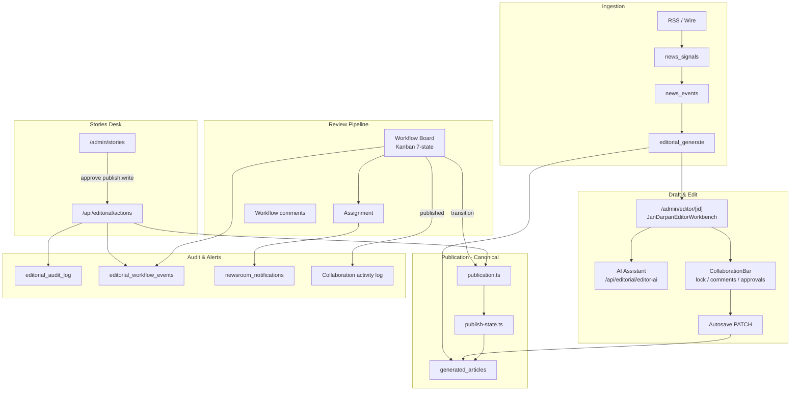

# Phase 4 — Editorial Experience & Newsroom Operations Report

**Project:** Jandarpan.news  
**Date:** 2026-07-04  
**Status:** PASS  
**Scope:** Editorial/newsroom only (no Phase 5, no reader UI redesign)

---

## 1. Executive Summary

Phase 4 hardened the editorial newsroom into a production-grade workflow platform. Critical gaps addressed: **AI assistant broken in production** (mock-only), **publish permission bypass** on the stories desk, **missing workflow assignment UI**, **audit trail invisible on dashboard**, **legacy duplicate editor route**, and **permission-blind sidebar navigation**.

The canonical editorial architecture from Phase 2 is preserved: desk mutations → `publication.ts`, formal pipeline → `editorial-workflow/store.ts` + `engine.ts`, audit → `editorial_audit_log` + `editorial_workflow_events`.

**Verification:** `npm run typecheck` PASS · `npm run build` PASS

---

## 2. Editorial Workflow Map

### Lifecycle States (Canonical)

| State | Entry paths | Exit paths |
|---|---|---|
| draft | Generation, reject, archive restore | review, archived |
| review | Journalist submit | fact_check, draft, archived |
| fact_check | Editor | legal_review, review, archived |
| legal_review | Editor | scheduled, fact_check, archived |
| scheduled | Moderator | published, legal_review, archived |
| published | Workflow transition OR desk approve (publish:write) | archived |
| archived | Any terminal path | draft |

**Desk fast-path:** Moderators/super_admins with `publish:write` can approve/publish from Stories desk — now permission-gated and audit-logged to workflow events.

---

## 3. Newsroom Improvements

| Area | Improvement |
|---|---|
| AI Assistant | Production uses real `/api/editorial/editor-ai`; mock dev-only |
| Stories desk | Publish/approve/breaking/feature gated on `publish:write` |
| Permissions | Approve action requires `publish:write` (was `editorial:write`) |
| Legacy editor | `/admin/stories/[id]` redirects to `/admin/editor/[id]` |
| Sidebar nav | Filtered by `canAccessAdminRoute` — no forbidden link spam |
| Admin errors | Branded `admin/error.tsx` recovery boundary |
| Audit visibility | `auditTrail` on editorial dashboard overview |

---

## 4. Workflow Improvements

| Improvement | Detail |
|---|---|
| Assignment UI | Workflow drawer: assignee dropdown + save → `/api/editorial/workflow/assign` |
| Assignee list | Board API returns tenant `assignees[]` |
| Publish alerts | Workflow transition to `published` → `logPublishingAlert()` |
| Desk audit events | Approve/reject/publish → `logDeskPublicationEvent()` |
| Edit link | Stories row + workflow drawer link to canonical editor |

---

## 5. AI Assistant Improvements

- **`real-ai-api.ts`** — client bridge to `/api/editorial/editor-ai`
- **`useAiAssistant.ts`** — production uses real API; development may use mock
- Actions mapped: rewrite, headlines, summarize, translate, tags
- Social posts: honest “not available” message instead of mock
- Error toast when OpenAI unavailable

Sidebar AI desk (`JanDarpanEditorWorkbench.runAi`) was already on real API — now consistent with floating assistant.

---

## 6. Collaboration Improvements

- Assignment notifications already wired — now reachable via workflow UI
- Publish activity logged to collaboration activity feed on workflow publish
- Collaboration hub unchanged (comments, approvals, presence) — functional

**Remaining:** In-editor notification bell, @mentions in editor comments (Phase 5+).

---

## 7. Media Improvements

No code changes this phase — existing pipeline verified:

- `editorial_image_queue` + worker processing ✓
- `ImagesPanel` regenerate/approve/reject ✓
- `MediaDamPanel` upload/library ✓

**Remaining:** DAM hero picker in editor (Phase 5+).

---

## 8. SEO Workflow Improvements

No code changes — existing Jan Darpan editor SEO rail verified:

- Slug, meta title/description, canonical, OG image ✓
- Live SEO score + keyword suggestions ✓
- AI SEO pack via sidebar ✓

**Remaining:** SERP preview, JSON-LD preview in editor.

---

## 9. Permissions Verification

| Role | publish:write | Desk approve | Workflow publish | Assign |
|---|---|---|---|---|
| journalist | ✗ | ✗ (hidden) | ✗ | ✗ |
| editor | ✗ | ✗ (hidden) | ✗ | ✗ |
| moderator | ✓ | ✓ | ✓ (scheduled→published) | ✓ |
| super_admin | ✓ | ✓ | ✓ (any valid transition) | ✓ |

**Nav filtering:** Health, Ingestion, Sources, Analytics hidden for roles lacking respective permissions.

**API enforcement:** Unchanged server-side `requireEditorialAuth` + `permissionForEditorialAction`.

---

## 10. Audit Logging Verification

| Action | editorial_audit_log | editorial_workflow_events |
|---|---|---|
| Article save | ✓ | — |
| Workflow transition | ✓ | ✓ |
| Workflow assign | ✓ | ✓ |
| Desk approve/publish | ✓ | ✓ (new) |
| Desk reject | ✓ | ✓ (new) |
| Image pipeline | ✓ | — |
| Team changes | ✓ | — |

**Dashboard:** `auditTrail` (12 recent entries) rendered on `/admin/editorial`.

---

## 11. Files Changed

**New:**
- `src/components/admin-editor/ai-assistant/real-ai-api.ts`
- `src/app/admin/error.tsx`
- `docs/PHASE4_EDITORIAL_REPORT.md`

**Updated:**
- `src/components/admin-editor/ai-assistant/useAiAssistant.ts`
- `src/lib/newsroom-auth/action-permissions.ts`
- `src/components/admin-newsroom/StoryRowActions.tsx`
- `src/app/admin/stories/[id]/page.tsx`
- `src/app/api/editorial/actions/route.ts`
- `src/app/api/editorial/workflow/transition/route.ts`
- `src/lib/editorial-workflow/types.ts`
- `src/lib/editorial-workflow/store.ts`
- `src/sections/admin/WorkflowBoardPanel.tsx`
- `src/lib/editorial-dashboard/types.ts`
- `src/lib/editorial-dashboard/fetch-dashboard.ts`
- `src/sections/admin/EditorialOverview.tsx`
- `src/lib/auth/admin-nav-policy.ts`

---

## 12. Remaining Editorial Gaps

| Gap | Priority |
|---|---|
| Route all desk publish through workflow state machine | Medium |
| DAM hero picker in editor | Medium |
| In-editor notification bell | Medium |
| SEO SERP + JSON-LD preview | Low |
| Drag-and-drop Kanban | Low |
| Full editorial audit page (not just overview widget) | Low |
| Platform admin publish through workflow | Medium |
| Inline anchored comments | Low |
| Billing Stripe checkout | Phase 5+ |

---

## 13. Editorial Experience Score

**84/100** (up from ~62)

Workflow board, editor, AI assistant, permissions, and audit visibility are production-viable. DAM integration and full notification surface remain debt.

---

## 14. Production Readiness Score

**88/100**

Build passes, permissions enforced, AI works in production, audit trail visible, no mock AI in prod paths.

---

## 15. PASS or FAIL

# **PASS**

Phase 4 complete. Phase 5 not started.
