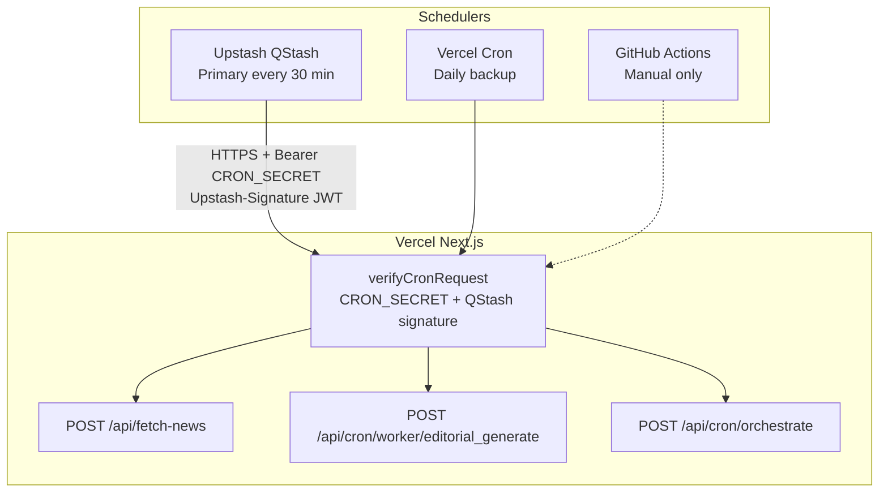

# Upstash QStash — Primary Production Scheduler

Jandarpan uses **Upstash QStash** as the primary scheduler for the newsroom pipeline. GitHub Actions remains **manual only** (`workflow_dispatch`). Vercel daily crons in `vercel.json` are a last-resort backup.

## Architecture



### Schedule cadence (UTC)

| Schedule ID | Cron | Endpoint | Offset |
|-------------|------|----------|--------|
| `jandarpan-fetch-news` | `7,37 * * * *` | `/api/fetch-news` | :07, :37 |
| `jandarpan-editorial-generate` | `10,40 * * * *` | `/api/cron/worker/editorial_generate` | :10, :40 |
| `jandarpan-orchestrate` | `15,45 * * * *` | `/api/cron/orchestrate` | :15, :45 |

Three-minute stagger lets ingest finish before editorial runs.

---

## 1. Create an Upstash account

1. Go to [https://console.upstash.com/](https://console.upstash.com/) and sign up (free tier is sufficient).
2. Open **QStash** in the left sidebar (not Redis — that is optional for caching).
3. Copy from the QStash dashboard:
   - **QSTASH_TOKEN** — API token for creating schedules
   - **QSTASH_CURRENT_SIGNING_KEY** — request verification (current)
   - **QSTASH_NEXT_SIGNING_KEY** — request verification (rotation)

---

## 2. Configure Vercel environment variables

In **Vercel → Project → Settings → Environment Variables** (Production):

| Variable | Required | Purpose |
|----------|----------|---------|
| `CRON_SECRET` | Yes | Bearer token for cron routes (existing) |
| `QSTASH_CURRENT_SIGNING_KEY` | Yes | Verify `Upstash-Signature` on inbound QStash deliveries |
| `QSTASH_NEXT_SIGNING_KEY` | Yes | Signing key rotation support |
| `QSTASH_TOKEN` | Setup only | Used by `scripts/setup-qstash-schedules.mjs` (not needed at runtime on Vercel) |

`QSTASH_TOKEN` is only required locally or in CI when running the setup script. Do **not** expose it to the browser.

After adding signing keys, **redeploy** production so `verifyCronRequest` can validate QStash JWTs.

---

## 3. Create QStash schedules

### Option A — Setup script (recommended)

From the repo root, with production secrets:

```bash
export QSTASH_TOKEN="qstash_..."
export CRON_SECRET="your_existing_cron_secret"
export PRODUCTION_URL="https://www.jandarpan.news"

npm run qstash:setup
```

The script is idempotent — re-running updates schedules by stable `scheduleId`.

**Important:** Use `https://www.jandarpan.news` (not the apex `jandarpan.news`). The apex domain returns HTTP 307 and breaks signature URL matching.

### Option B — Upstash Console

For each schedule in the table above:

1. QStash → **Schedules** → **Create Schedule**
2. **Destination:** full URL (e.g. `https://www.jandarpan.news/api/fetch-news`)
3. **Cron:** from table
4. **Method:** `POST`
5. **Headers:** `Authorization: Bearer <CRON_SECRET>`
6. **Body:** `{}` for orchestrate only; leave empty for others
7. **Retries:** 3

---

## 4. Verify after deploy

1. **Upstash console → QStash → Logs** — expect ~96 deliveries/day per schedule (48×2).
2. **Vercel → Functions** — filter `editorial_generate`, confirm HTTP 200.
3. **Supabase** — `generated_articles` `created_at` should show steady new rows.
4. **Manual fallback** — GitHub Actions → **Enterprise Workers** → **Run workflow**.

### Expected throughput

| Metric | Value |
|--------|-------|
| Editorial fires/day | 48 |
| Batch size (`EDITORIAL_BATCH_LIMIT`) | 6 (default) |
| Theoretical articles/day | up to **288** |
| Sustained rate (typical accept rate) | **~10–12 articles/hour** |
| Backlog clearance (2,682 events) | **~9–11 days** at sustained rate |

Orchestrate may publish additional articles when `NEWSROOM_AUTO_PUBLISH=true`.

---

## 5. Authentication behavior

`verifyCronRequest()` accepts **either**:

1. **CRON_SECRET** — `Authorization: Bearer …` or `x-cron-secret` (Vercel daily backup, GitHub manual)
2. **QStash signature** — valid `Upstash-Signature` JWT verified with signing keys

QStash schedules also send `Authorization: Bearer CRON_SECRET` for defense in depth.

---

## 6. Backup schedulers

| Scheduler | Role |
|-----------|------|
| **QStash** | Primary — every 30 minutes |
| **Vercel Cron** | Daily safety net (`vercel.json`: `0:15` ingest, `0:45` editorial) |
| **GitHub Actions** | Manual pipeline only (`workflow_dispatch`) |

---

## 7. Troubleshooting

| Symptom | Action |
|---------|--------|
| 401/403 from QStash deliveries | Confirm `CRON_SECRET` in schedule headers matches Vercel |
| Signature verification fails | Confirm `QSTASH_*_SIGNING_KEY` on Vercel; redeploy; check destination URL matches JWT `sub` exactly |
| 307 / redirect in QStash logs | Change destination to `https://www.jandarpan.news` |
| `overlap_lock` in response | Normal — previous editorial run still active |
| No deliveries in Upstash | Schedule may take up to 60s to activate; check cron expression (UTC) |

---

## Related docs

- [GITHUB_ACTIONS_WORKERS.md](./GITHUB_ACTIONS_WORKERS.md) — manual workflow
- [HOBBY_DEPLOYMENT_MODE.md](./HOBBY_DEPLOYMENT_MODE.md) — Vercel Hobby limits
- [WORKER_ARCHITECTURE.md](./WORKER_ARCHITECTURE.md) — worker queue design
