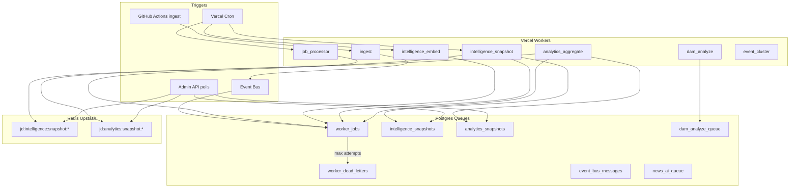

# Jan Darpan OS — Worker Architecture

Scalable async processing for AI, intelligence, analytics, and DAM — replacing polling-heavy realtime rebuilds with precomputed snapshots.

## Problem → Solution

| Before | After |
|--------|-------|
| Intelligence dashboard polls every 20s and **re-embeds + re-clusters** on each GET | Workers precompute; GET reads **Redis → DB snapshot** |
| Enterprise analytics rebuilt every 12s poll | `analytics_snapshots` + Redis cache |
| DAM vision AI runs inline on upload | `dam_analyze` jobs via `dam_analyze_queue` |
| No unified retries / DLQ | `worker_jobs` + `worker_dead_letters` + exponential backoff |
| Cron only daily orchestrate | Distributed crons: jobs (10m), embed (20m), snapshot (15m), health (6h) |

---

## Architecture Diagram



---

## Queue Flow Map

```
ingest.completed (event)
    ├─► embed_signals          (dedupe: embed_signals:{tenant})
    ├─► intelligence_cluster   (semantic union-find)
    ├─► intelligence_snapshot  (full worker-mode build)
    └─► analytics_aggregate    (enterprise report rollup)

signals.created
    ├─► embed_signals
    └─► intelligence_cluster

articles.published
    ├─► embed_articles
    ├─► seo_analysis      ──► delegates to intelligence_snapshot
    └─► intelligence_snapshot

dam.asset.uploaded
    └─► dam_analyze

intelligence.refresh
    └─► intelligence_snapshot
```

### Job lifecycle

```
pending → claimed → completed
                 ↘ failed → pending (retry + backoff)
                          ↘ dead → worker_dead_letters
```

**Deduplication:** `(job_type, dedupe_key)` unique among `pending` and `claimed` jobs. Re-enqueue updates `scheduled_at` and `priority` instead of creating duplicates.

---

## Workers

| Worker ID | Drains | Responsibility |
|-----------|--------|----------------|
| `ingest` | RSS/API providers | Signal + article ingestion |
| `ai_enrich` | `news_ai_queue` | Legacy article AI enrichment |
| `editorial_generate` | events | Generated editorials |
| `editorial_images` | `editorial_image_queue` | Hero images |
| `job_processor` | `worker_jobs` + event bus | General drain |
| `intelligence_embed` | embed_* jobs | OpenAI embeddings → `intelligence_embeddings` |
| `intelligence_snapshot` | snapshot/cluster/seo/translation jobs | Full snapshot → `intelligence_snapshots` + Redis |
| `analytics_aggregate` | analytics jobs | Enterprise report → `analytics_snapshots` |
| `dam_analyze` | dam jobs + queue | Vision tagging/OCR/captions |
| `event_cluster` | event_cluster jobs | TF-IDF signal→event clustering |

---

## Redis Usage

Redis (Upstash REST) is **cache-only**, not a job broker.

| Key pattern | TTL | Purpose |
|-------------|-----|---------|
| `jd:intelligence:snapshot:{tenant}` | 60s (env: `INTELLIGENCE_CACHE_TTL_SEC`) | Hot intelligence dashboard reads |
| `jd:analytics:snapshot:{tenant}:{hours}` | 300s | Enterprise analytics panel |
| `news:snapshot:last-success` | existing | Homepage stale feed |

**Why not Bull/Redis queues?** Postgres queues match existing `news_ai_queue` pattern — durable, observable, RLS-safe, no extra infra.

---

## Retry Strategy

Configured in `src/lib/infrastructure/jobs/retry.ts`:

| Setting | Env | Default |
|---------|-----|---------|
| Base delay | `WORKER_RETRY_BASE_MS` | 2000ms |
| Max delay | `WORKER_RETRY_MAX_MS` | 300000ms |
| Jitter | `WORKER_RETRY_JITTER` | 15% |
| Max attempts | per-job `max_attempts` | 5 |

Formula: `delay = min(max, base × 2^(attempt-1)) ± jitter`

After max attempts → `worker_dead_letters` with full payload for manual replay.

Per-job timeout via `timeout_ms` (default 120s) with `Promise.race`.

---

## Scaling Strategy

### Horizontal (serverless)

- Multiple cron invocations are safe: `claimJobBatch` uses status transition `pending → claimed`.
- Increase throughput: raise `WORKER_JOB_BATCH`, add more frequent `/api/cron/jobs` schedule.
- Split heavy workers onto dedicated crons (already in `vercel.json`).

### Vertical (within invocation)

- `INGEST_BUDGET_MS` (default 52s) gates orchestrator pipeline.
- Intelligence snapshot worker processes **2 jobs** per run (heavy).
- Embed worker processes up to **8** signals/articles per batch.

### Multi-tenant

- All jobs carry `tenant_id`; dedupe keys are tenant-scoped.
- `intelligence_snapshots` has `unique(tenant_id)` for one active snapshot per tenant.

### Recommended production schedule

| Endpoint | Schedule | Role |
|----------|----------|------|
| GitHub Actions → `/api/fetch-news` | */30 | Primary ingest |
| `/api/cron/jobs` | */10 | Event delivery + job drain |
| `/api/cron/worker/intelligence_embed` | */20 | Embedding backfill |
| `/api/cron/worker/intelligence_snapshot` | */15 | Snapshot materialization |
| `/api/cron/orchestrate` | daily 08:00 UTC | Full pipeline backup |
| `/api/cron/workers/health` | */6 hours | Monitoring |

---

## API Endpoints

| Method | Path | Auth | Purpose |
|--------|------|------|---------|
| POST | `/api/cron/jobs` | `CRON_SECRET` | Drain jobs + events |
| POST | `/api/cron/worker/:name` | `CRON_SECRET` | Run single worker |
| GET | `/api/cron/workers/health` | `CRON_SECRET` | Queue stats + 24h health |
| GET | `/api/editorial/intelligence` | session | Read cached snapshot |
| GET | `/api/analytics/enterprise` | session | Read cached analytics |

---

## Deployment Instructions

### 1. Apply migration

```bash
cd newspaper-motion
npx supabase db push
# or run supabase/migrations/033_worker_infrastructure.sql in SQL editor
```

### 2. Environment variables

```env
# Required (existing)
CRON_SECRET=...
OPENAI_API_KEY=...
SUPABASE_SERVICE_ROLE_KEY=...

# Redis cache (recommended)
UPSTASH_REDIS_REST_URL=...
UPSTASH_REDIS_REST_TOKEN=...

# Worker tuning (optional)
INTELLIGENCE_WORKERS_ENABLED=true
WORKER_JOB_BATCH=8
INTELLIGENCE_CACHE_TTL_SEC=60
INTELLIGENCE_STALE_MS=300000
WORKER_RETRY_BASE_MS=2000
WORKER_RETRY_MAX_MS=300000
DAM_ANALYZE_BATCH=4
```

### 3. Vercel crons

`vercel.json` includes new schedules. Deploy to Vercel Pro (crons require Pro for sub-daily in some plans).

Ensure `CRON_SECRET` is set in Vercel project env. Cron requests must send:

```
Authorization: Bearer <CRON_SECRET>
```

### 4. GitHub Actions (ingest)

After ingest, events auto-publish when `signalsInserted > 0`. Optionally add a post-ingest step:

```yaml
- name: Drain worker jobs
  run: |
    curl -X POST "$APP_URL/api/cron/jobs" \
      -H "Authorization: Bearer ${{ secrets.CRON_SECRET }}"
```

### 5. Initial backfill

```bash
curl -X POST "https://your-app.vercel.app/api/cron/worker/intelligence_embed" \
  -H "Authorization: Bearer $CRON_SECRET"

curl -X POST "https://your-app.vercel.app/api/cron/worker/intelligence_snapshot" \
  -H "Authorization: Bearer $CRON_SECRET"
```

### 6. Verify health

```bash
curl "https://your-app.vercel.app/api/cron/workers/health" \
  -H "Authorization: Bearer $CRON_SECRET"
```

Expect `queue.pending` near 0 after backfill; `health` shows per-worker success rates.

### 7. DAM async analyze (optional)

```ts
import { enqueueDamAnalyze } from "@/lib/dam/analyze-queue";
await enqueueDamAnalyze(tenantId, assetId);
```

---

## Monitoring

- **`worker_job_runs`** — every job/worker execution (duration, ok, error)
- **`GET /api/cron/workers/health`** — aggregated 24h success rate per worker
- **`worker_dead_letters`** — failed jobs for manual inspection/replay
- Response `_cache` field on intelligence/analytics APIs shows snapshot source and age

---

## File Map

| Path | Role |
|------|------|
| `supabase/migrations/033_worker_infrastructure.sql` | Schema |
| `src/lib/infrastructure/jobs/` | Queue, retry, handlers, monitor |
| `src/lib/infrastructure/events/event-bus.ts` | Pub/sub |
| `src/lib/infrastructure/workers/intelligence-workers.ts` | New workers |
| `src/lib/intelligence/snapshot-cache.ts` | Read path |
| `src/lib/analytics/snapshot-cache.ts` | Analytics read path |
| `src/lib/dam/analyze-queue.ts` | DAM enqueue helper |

---

## Migration from polling

Admin panels can keep their poll intervals; each poll now hits **cached snapshots** (~5–50ms) instead of rebuilding embeddings (~2–10s). Consider increasing poll intervals to 60s once workers are warm.

To force refresh from UI, enqueue via `requestSnapshotRefresh(tenantId)` or publish `intelligence.refresh` event.
