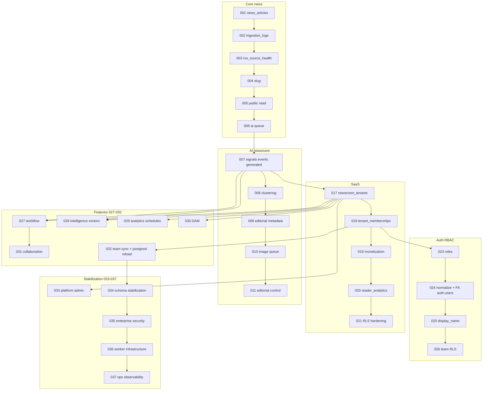

# Migration dependency graph

## Critical path for admin systems

| Feature | Minimum migrations |
|---------|-------------------|
| Team / RBAC | 018 → 021 → 024 → 025 → 032 → **034** |
| Workflow board | 007 → 011 → 017 → 027 → **034** |
| Intelligence vectors | 017 → 028 → **034** |
| DAM | 017 → 030 → **034** |
| Collaboration | 027 → 031 → **034** |
| Ingestion admin | 002 → 003 → **034** |

## Version collision rule

Supabase uses the **numeric prefix only** as `schema_migrations.version`. Only one file per version number (e.g. one `034_*.sql`).
